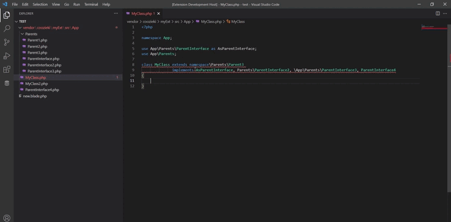

# PHP Implementor
Implement php interface/abstract class methods faster!

## IMPORTANT!

>All the settings should be located in the `.vscode/settings.json` file in the **root** folder of your workspace and not in **global** settings. This way you will define your workspace specific configurations and you wouldn't need to change the global settings every time you switch to another project.

## Demonstration


## Usage

For the extension to work, your project must follow the [PSR-4](https://www.php-fig.org/psr/psr-4/) autoloading standarts, which means, that if you have a class with a namespace like this:

```php
   <?php 

   namespace App\Controllers;

   class IndexController {

   }
```

IndexController must be located in `App/Controllers/IndexController.php` file. However, extension allows you to define the location of your **root** namespace. For instance, let's define the location of `App` namespace from the example above, as if the `App` namespace was located in `src/App` folder:

```json
     "php-implementor.autoloads": {
        "App": "src/App/"
    }
```

### Version 1.4.0+

Now you can import your paths for root namespaces from `composer.json` files with the setting below:

```json
     "php-implementor.useComposerAutoloads": true
```

If you're working with **multiple** projects in your workspace and your `composer.json` file is not at the **root** of your workspace, you must specify a `php-implementor.composerPath` option in the `.vscode/settings.json` file in the **root** folder of your workspace:

```json
     "php-implementor.composerPath": "path/to/project"
```

The `php-implementor.useComposerAutoloads` is now enabled by **default**. If you don't want to use `composer.json`, you should disable it and use `php-implementor.autoloads` instead to manually specify paths for your root namespaces.